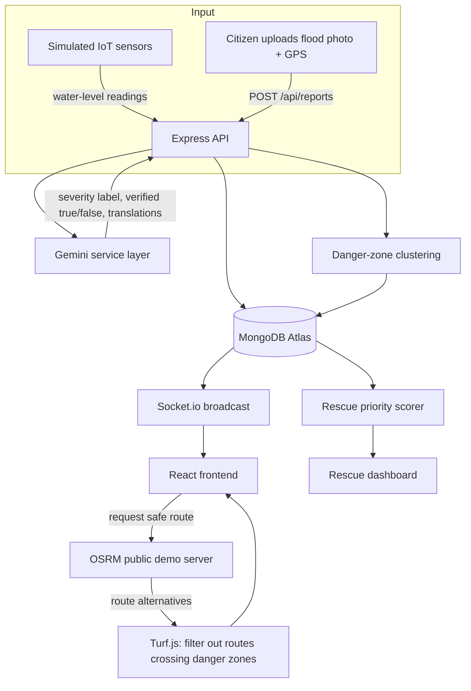

# ResistFlood — Build Plan

Reference doc for whichever AI coding agent is doing the implementation. Keep this file in the repo root. `AGENTS.md` (also in this repo) is the short entry-point file the agent auto-loads every session — it points here for detail. Work phase by phase from §7; don't skip ahead.

---

## §1 — Feature set

**Original concept (from the presentation):**
- IoT-style water-level sensors feeding a live danger map
- AI turns raw sensor data into plain-language, multi-language safety instructions
- Citizens report hazards by photo + GPS; AI clusters reports into verified hotspots

**New features (this build adds):**
- AI-assisted navigation to the nearest safe place, routed around active danger zones
- A rescue-priority system that surfaces which elderly/vulnerable residents to reach first
- Image-based flood reporting with AI verification (extends the crowdsourcing above with an actual vision check, not just a photo dump)

These three aren't separate add-ons bolted onto the original — they share one pipeline: sensor + image reports → AI verification/clustering → danger zones, and danger zones then drive *both* the safe-route logic and the rescue-priority scoring. See §3.

---

## §2 — Tech stack & why

Everything here is free with no credit card, and current as of mid-2026 — checked before writing this, not assumed. If you're reading this much later, the "double-check" column tells you what to re-verify.

| Layer | Choice | Why this one | Double-check |
|---|---|---|---|
| Runtime | Node.js 24.x (Active LTS) | Node 22 is now Maintenance-only; Node 26 isn't LTS until Oct 2026 | nodejs.org/en/about/previous-releases |
| Backend framework | Express **5.x** | 5.1+ became the default `latest` on npm; Express 4 is now the legacy line | `npm view express version` |
| Database | MongoDB Atlas **Free/M0** via Mongoose | 512MB, no time limit, genuinely free forever, one per project | — |
| Frontend | React 19 + **Vite** | Create React App is deprecated; Vite is the standard replacement | — |
| Styling | Tailwind CSS | fast, matches your existing habits | — |
| Maps | Leaflet + react-leaflet + OpenStreetMap tiles | Zero API key, zero billing account. Google Maps' free credit still requires a card on file — skip that friction entirely | — |
| Routing | OSRM public demo server + Turf.js | Free, no key, open-source. It's explicitly a *demo* server (see §7 Phase 6) — fine for this project, not for real production traffic | github.com/Project-OSRM/osrm-backend/wiki/Api-usage-policy |
| AI | Gemini API via **`@google/genai`**, model **`gemini-2.5-flash`** | Current unified SDK. The older `@google/generative-ai` package is retired — don't let the agent reach for it out of habit | ai.google.dev/gemini-api/docs/models |
| Images | Cloudinary Free | 25 credits/month (1 credit = 1GB storage OR 1GB bandwidth OR 1,000 transforms), no card | — |
| Realtime | Socket.io | standard, works fine on Render's free tier | — |
| Push alerts | `web-push` (VAPID) | Native browser standard, no third-party account at all | — |
| Auth | JWT (`jsonwebtoken`) + `bcrypt` | evergreen, no deprecation risk | — |
| Backend hosting | **Render** free Web Service | Genuinely free, no card. Sleeps after 15 min idle, ~30–60s cold start on next request — see §9 | — |
| Frontend hosting | **Vercel** Hobby | Free forever, no card, personal/non-commercial use (fine here) | — |
| ~~Railway~~ | *avoid* | No longer has a real free tier — trial credit only, and now asks for a card | — |

### Free-tier ceilings worth knowing before you build

| Service | Ceiling | What happens if you hit it |
|---|---|---|
| Gemini API | Shared per Google Cloud project (not per key): roughly 10 RPM / a few hundred to ~1,000 requests per day depending on model, resets midnight Pacific | 429 errors — handle with backoff (§9), don't panic-upgrade |
| **Never enable billing on the Gemini project** | — | Turning billing on deletes the free tier for that project entirely, from the first token. If you ever want a paid fallback, use a *second* Google Cloud project for it |
| MongoDB Atlas M0 | 512MB storage, 500 connections | Watch connection pooling if you spin up serverless functions elsewhere |
| Cloudinary | 25 credits/month | Resize images client-side before upload |
| Render free Web Service | 750 hrs/month, sleeps after 15 min idle | Wake it manually ~2 min before a live demo |
| Vercel Hobby | 100GB bandwidth/month | Won't matter at student-project scale |
| OSRM demo server | 1 request/second, "reasonable non-commercial use" | Debounce client-side; never poll it |

---

## §3 — Architecture & data flow



**Honest framing for whoever asks "where's the AI":** the route *geometry* is plain graph-search (OSRM) — that part isn't AI and doesn't need to pretend to be. Gemini's actual jobs are: (a) deciding which alternative route is safe given the danger zones, (b) verifying/describing flood photos, (c) turning structured data into calm, simple, translated instructions. That's a more accurate — and more defensible in a viva — description than "AI calculates the route."

---

## §4 — Data models

```
User
  name, email (unique), passwordHash
  role: "citizen" | "volunteer" | "authority" | "admin"
  phone                      // optional, used for click-to-call later
  preferredLanguage: "en" | "hi" | "kn" | ...
  createdAt

SensorReading
  deviceId                   // e.g. "sim-silkboard-01"
  location: { lat, lng }
  waterLevelCm
  source: "simulated" | "hardware"
  recordedAt

FloodReport
  reportedBy: User | null    // null = anonymous report allowed
  imageUrl                   // Cloudinary secure_url
  location: { lat, lng }
  note                       // optional citizen text
  ai: {
    isLikelyFlood: boolean
    severityEstimate: "unclear" | "minor" | "moderate" | "severe"
    reasoning                // one line, for moderators, not shown to public
  }
  status: "pending" | "verified" | "rejected" | "merged"
  dangerZoneId: DangerZone | null
  createdAt

DangerZone
  center: { lat, lng }
  radiusMeters
  severity: "minor" | "moderate" | "severe"
  sourceReportIds: [FloodReport]
  sourceReadingIds: [SensorReading]
  status: "active" | "resolved"
  createdAt, updatedAt

Alert
  dangerZoneId: DangerZone
  translations: [{ lang, text }]   // Gemini-generated per language
  createdAt

VulnerablePerson
  registeredBy: User
  name
  location: { lat, lng }
  mobilityNotes              // free text, e.g. "wheelchair user, 3rd floor, no lift"
  emergencyContactPhone
  lastCheckIn
  status: "safe" | "needs-check" | "rescued"

RescueTask
  personId: VulnerablePerson
  priorityScore              // computed, see §7 Phase 7
  assignedTo: User | null
  status: "pending" | "claimed" | "en-route" | "rescued"
  distanceToNearestZoneMeters
  updatedAt

PushSubscription
  userId: User
  endpoint, keys: { p256dh, auth }
```

---

## §5 — API reference

| Method | Path | Purpose |
|---|---|---|
| POST | `/api/auth/register` | create account |
| POST | `/api/auth/login` | issue JWT |
| GET | `/api/auth/me` | current user |
| POST | `/api/sensors/reading` | ingest one reading (device or simulator, no auth) |
| GET | `/api/sensors/latest` | latest reading per device, for the map |
| POST | `/api/reports` | citizen submits photo + location → triggers Gemini verification |
| GET | `/api/reports?status=verified` | list, for map/moderation |
| GET | `/api/danger-zones/active` | current clusters — feeds both the map and routing |
| GET | `/api/alerts/:zoneId?lang=kn` | translated instructions for a zone |
| POST | `/api/push/subscribe` | register a push subscription |
| POST | `/api/navigate/safe-route` | body `{from, to?}` → route avoiding active zones |
| GET | `/api/shelters` | seeded list of safe destinations |
| POST | `/api/rescue/register` | add a vulnerable person |
| GET | `/api/rescue/queue` | priority-sorted list |
| PATCH | `/api/rescue/:id/claim` | volunteer claims a case |
| PATCH | `/api/rescue/:id/status` | update case status |

---

## §6 — Environment variables & getting every key for free

```
MONGODB_URI=              # cloud.mongodb.com → free M0 cluster → Connect → driver string
JWT_SECRET=                # any long random string — `openssl rand -hex 32`
GEMINI_API_KEY=            # aistudio.google.com → "Get API key" → no billing account needed
CLOUDINARY_CLOUD_NAME=
CLOUDINARY_API_KEY=
CLOUDINARY_API_SECRET=     # cloudinary.com free signup → Dashboard shows all three
VAPID_PUBLIC_KEY=
VAPID_PRIVATE_KEY=         # generate locally: npx web-push generate-vapid-keys
VAPID_SUBJECT=mailto:you@example.com
CLIENT_URL=http://localhost:5173   # CORS; update to the real Vercel URL after deploying
PORT=5000
```

None of these need a credit card. If the AI IDE asks you to "enable billing" for anything in this list, stop and check §2 — that's the one trap in this whole stack (it kills Gemini's free tier specifically).

---

## §7 — Build phases

Work through these **in order** with your AI IDE. Each prompt is written to be pasted as-is. Each phase assumes the previous one's files already exist — don't jump ahead, and run the Verify step before moving on.

### Phase 0 — Scaffold
> Read AGENTS.md fully. Set up the ResistFlood project skeleton:
> - `/server` — Node 24 + Express 5, ESM (`"type": "module"`), folders `routes/ controllers/ models/ services/ middleware/ config/`. One entry `index.js` that loads `.env`, connects to MongoDB via Mongoose, starts on `PORT`. One route: `GET /api/health` → `{ status: "ok" }`.
> - `/client` — React 19 + Vite + Tailwind, react-router-dom, placeholder pages Login/Map/Report/Rescue/Admin, and a Home page that fetches `/api/health` and displays it.
> - `.env.example` in both folders listing every variable from BUILD_PLAN.md §6, values blank.
> - Root README with the two `npm install && npm run dev` commands.
> Nothing functional yet beyond the health check — I want to confirm the scaffold runs before we add real features.

**Verify:** both dev servers run, client shows `{status: "ok"}`.

### Phase 1 — Auth
> Read BUILD_PLAN.md §4 (User) and §5 (auth endpoints). Implement the User model, `POST /api/auth/register`, `POST /api/auth/login` (bcrypt + jsonwebtoken), `GET /api/auth/me` behind an auth middleware reading `Authorization: Bearer <token>`. Client: working Login/Register forms, store the JWT, redirect to Map on success, and an axios instance that attaches the token to every request.

**Verify:** register, refresh the page, confirm `/me` still resolves.

### Phase 2 — Simulated IoT feed
> Read BUILD_PLAN.md §4 (SensorReading) and §5. Implement the model, `POST /api/sensors/reading` (no auth), `GET /api/sensors/latest`. Then write `server/scripts/simulateSensors.js` that posts a slowly rising `waterLevelCm` every 10 seconds for four fixed devices at real Bengaluru flood-prone points: Silk Board Junction (12.9166, 77.6228), Bellandur (12.9304, 77.6784), K.R. Puram (13.0088, 77.6959), Sarjapur Road (12.9008, 77.6885). Add `npm run simulate` to run it. Client: show these as color-coded markers on a Leaflet map (OpenStreetMap tiles, no key) — pick sensible green/yellow/red thresholds, e.g. <15cm / 15–40cm / >40cm.

**Verify:** run the simulator, watch a marker's color change live.

### Phase 3 — Gemini service layer
> Read BUILD_PLAN.md §2 (why `@google/genai`, not `@google/generative-ai`). Create `server/services/gemini.js` as the **only** place that calls the Gemini API — every other file imports from here. Export `classifySeverity({ waterLevelCm, recentReports })` and `translateInstruction({ text, targetLangs })`. Use model `gemini-2.5-flash`, read `GEMINI_API_KEY` from env, wrap calls in try/catch with one retry using exponential backoff on 429s (see §9). If the SDK's method signature has changed since this doc was written, check ai.google.dev/gemini-api/docs/quickstart and adapt — don't fall back to the old package.

**Verify:** a throwaway test script calling `classifySeverity` with a fake high `waterLevelCm` prints a sensible label.

### Phase 4 — Image reports + AI verification
> Read BUILD_PLAN.md §4 (FloodReport) and §5. Implement Cloudinary upload (multer → memory buffer → `upload_stream`), `POST /api/reports` (image + lat/lng + optional note, auth optional — anonymous reports allowed). After upload, call a new `verifyFloodImage({ imageUrl, note })` in gemini.js — multimodal input, ask Gemini to return JSON `{ isLikelyFlood, severityEstimate, reasoning }`. Save under `report.ai`, set status `pending` if likely-flood else `rejected`. Add `GET /api/reports?status=verified`. Client: Report page — photo capture/upload, browser Geolocation API (manual pin-on-map fallback if permission denied), submit, confirmation screen.

**Verify:** submit an obviously unrelated photo → rejected; submit a real water/flood photo → accepted with a severity estimate.

### Phase 5 — Clustering into danger zones
> Read BUILD_PLAN.md §4 (DangerZone). Implement `updateDangerZones()` in `server/services/clustering.js`: runs on every new verified report and every 60s via `setInterval`. Groups verified reports + sensor readings above the "moderate" threshold that are within 300m and 2 hours of each other into a DangerZone (center = average location, radius = 300m + distance to farthest member, severity = highest among members). Marks a zone `resolved` after 3 hours with no new supporting reading/report. Expose `GET /api/danger-zones/active`. Client: draw active zones as translucent red circles on the map (poll every 15s for now — Socket.io replaces this in Phase 8).

**Verify:** two nearby verified reports merge into one zone; a distant one creates a separate zone.

### Phase 6 — Safe navigation
> Read BUILD_PLAN.md §5 and §7 (this phase). Seed a Shelter collection with 4–5 real large public buildings/grounds in Bengaluru (schools, community halls, stadiums — look them up) as stand-ins for official relief camps; expose `GET /api/shelters`. Implement `POST /api/navigate/safe-route` — body `{from, to?}`, defaults `to` to the nearest Shelter if omitted. Call OSRM's public demo server (`router.project-osrm.org`) with `alternatives=true&geometries=geojson&overview=full` for 2–3 route options, and use Turf.js `booleanIntersects` to test each route against every active DangerZone (built as a `turf.circle`). Return the first zero-intersection alternative; if all intersect, return the least-overlapping one with `caution: true`, plus a one-paragraph Gemini-generated plain-language summary of the route. Debounce so the client never sends more than 1 request/second to OSRM, and cache identical repeated requests. Client: "Find safe route" button, draws the polyline, shows the caution flag and the plain-language instructions.

**Verify:** place a DangerZone directly between the test location and the nearest shelter — the route should bend around it, or honestly show `caution: true` if it geographically can't.

### Phase 7 — Rescue priority queue
> Read BUILD_PLAN.md §4 (VulnerablePerson, RescueTask) and §8 before starting. Implement `POST /api/rescue/register` (any logged-in user can register someone). Write `scoreRescueTasks()`: recomputes `priorityScore` for every non-rescued task whenever DangerZones change — `score = (0.7 × inverse of distanceToNearestZoneMeters) + (0.3 × hours since lastCheckIn)`, as plain constants you can tune later, don't overthink it. `GET /api/rescue/queue` sorted descending. `PATCH /api/rescue/:id/claim` and `/status`. Client: Rescue Dashboard — queue list with distance/last-check-in, map view, Claim button, and a **Call** button that is a plain `<a href="tel:+91...">` — not an API call. Add a short code comment explaining why (§8).

**Verify:** register two people at different distances from an active zone; the closer one ranks higher.

### Phase 8 — Realtime wiring
> Add Socket.io to server and client. Server emits `danger-zone:update`, `rescue-queue:update`, `sensor:update` whenever those change, replacing the Phase 2/5 polling. Client subscribes on the Map and Rescue Dashboard and updates state live. Keep polling as a fallback on disconnect — Render's free tier drops idle connections when it sleeps, so rely on socket.io-client's built-in reconnection.

**Verify:** two browser tabs open; a report submitted in one produces a live zone update in the other, no refresh.

### Phase 9 — Push notifications & UI polish
> Read BUILD_PLAN.md §6 for VAPID. Implement the subscribe flow (permission → service worker → PushManager → `POST /api/push/subscribe`). Server pushes (via the `web-push` package) to all subscriptions within 1km of a new "severe" DangerZone, in each recipient's `preferredLanguage` using Alert translations from gemini.js. Then pull Map/Report/Rescue/Login into one coherent, mobile-first nav (this will very likely be demoed on a phone) with a language switcher that re-fetches Alert translations.

**Verify:** trigger a severe zone via the simulator, confirm a browser push notification appears.

### Phase 10 — Deploy
> Deploy `/server` to Render (free Web Service, connect the GitHub repo, set every §6 env var in Render's dashboard, build `npm install`, start `npm start`). Deploy `/client` to Vercel (import the repo, Vite preset, `VITE_API_URL` env var pointing at the Render URL). Update the server's `CLIENT_URL` to the real Vercel URL for CORS. Confirm the full journey works on the live URLs, not just localhost.

**Verify:** register → see sensors on map → submit a report → watch it become a danger zone → get a safe route → see it reflected in the rescue dashboard, all on the deployed site.

---

## §8 — Why rescue "calls" are click-to-call, not auto-dial

Worth understanding before Phase 7, so it doesn't look like a shortcut: automating actual outbound phone calls (to family, volunteers, or — worse — to real emergency numbers like 100/108/112) needs a paid, business-verified telephony provider, and in India specifically, bulk/automated SMS and voice both need DLT/TRAI registration that a student project isn't set up to have. None of that is free, and dialing real emergency lines programmatically isn't something to build without an actual partnership with local disaster-management authorities — that's future-roadmap territory, not this build.

The part of "rescue calls" that's actually valuable — deciding *who* to reach first — is exactly what the priority queue in Phase 7 does. A plain `tel:` link then makes the literal call one tap, using the phone's own dialer, for free, with no API at all. That's not a downgrade of the idea; it's the version of it that's honest about what a free-tier student build can respons­ibly automate versus what a person should still be doing on the other end of the line.

---

## §9 — Common errors & fixes

| Symptom | Likely cause | Fix |
|---|---|---|
| Gemini call returns 429 | Free-tier RPM/RPD hit | Exponential backoff (Phase 3); move high-volume calls (image verification) to `gemini-2.5-flash-lite` |
| Gemini call returns "model not found" | Model name typo, or retired since this doc was written | Check ai.google.dev/gemini-api/docs/models for the current free-tier list |
| Mongoose "connection timed out" | Atlas Network Access doesn't allow your IP / Render's IP | Atlas → Network Access → allow `0.0.0.0/0` (fine for a free demo cluster) |
| CORS error in the browser console | `CLIENT_URL` on the server doesn't exactly match the frontend URL | Match it exactly (scheme, no trailing slash), redeploy |
| OSRM route request hangs or 429s | Exceeding the demo server's 1 req/sec | Client-side debounce (Phase 6); self-host OSRM via Docker if this ever becomes a real deployment |
| Render app unreachable right before a demo | Free tier cold start after 15 min idle | Open the URL yourself ~2 minutes before presenting |
| Cloudinary upload fails silently | Free tier's 25 credits/month used up | Resize images client-side (canvas) to under ~1MB before upload |
| Push notification never arrives | VAPID key mismatch, or browser permission denied | Regenerate with `npx web-push generate-vapid-keys`, re-subscribe |

---

## §10 — Testing / demo-day checklist

- [ ] Register + login works
- [ ] Simulated sensors show live on the map, colors change with water level
- [ ] Submitting a flood photo gets verified/rejected sensibly
- [ ] Two nearby verified reports merge into one danger zone; a distant one doesn't
- [ ] Safe route avoids an active zone, or honestly flags `caution: true` when it can't
- [ ] Rescue queue sorts by real priority; Claim and Call buttons both work
- [ ] Two open tabs stay in sync live (Socket.io)
- [ ] Push notification fires for a severe zone
- [ ] Full flow works on the deployed URLs, not just localhost
- [ ] Render backend woken up ~2 minutes before presenting

---

## §11 — Honest limitations & real-world upgrade path

- **OSRM demo server** is for evaluation, not production traffic — self-host it (Docker image, well documented) if this ever leaves the demo stage.
- **No real IoT hardware** here — `simulateSensors.js` stands in. An ESP32 + ultrasonic sensor posting to the same `/api/sensors/reading` endpoint is a drop-in replacement later, not a rewrite.
- **Rescue "calls" are click-to-call by design** — see §8. Real automated dispatch needs an actual partnership with local disaster-management authorities, not just an API key.
- **Gemini free tier** is rate-limited, and Google's terms allow using free-tier input/output to improve their models — fine for a demo with test data, worth revisiting if this ever handles real people's real locations.
- **Shelters list is manually seeded**, not an official government feed — a real deployment would need that from BBMP/local disaster-management authorities if such a feed is ever opened up.
